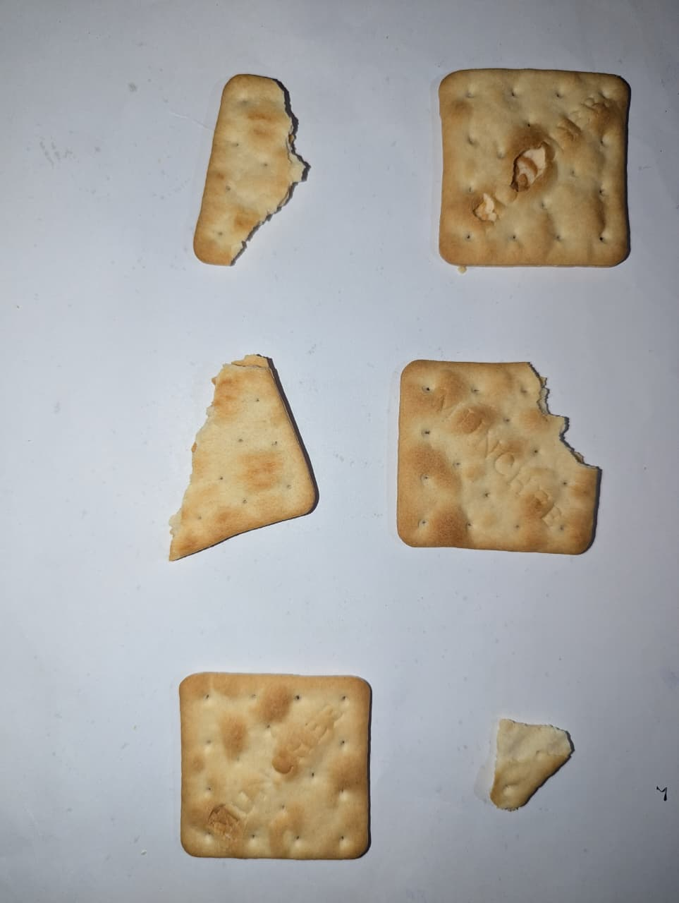
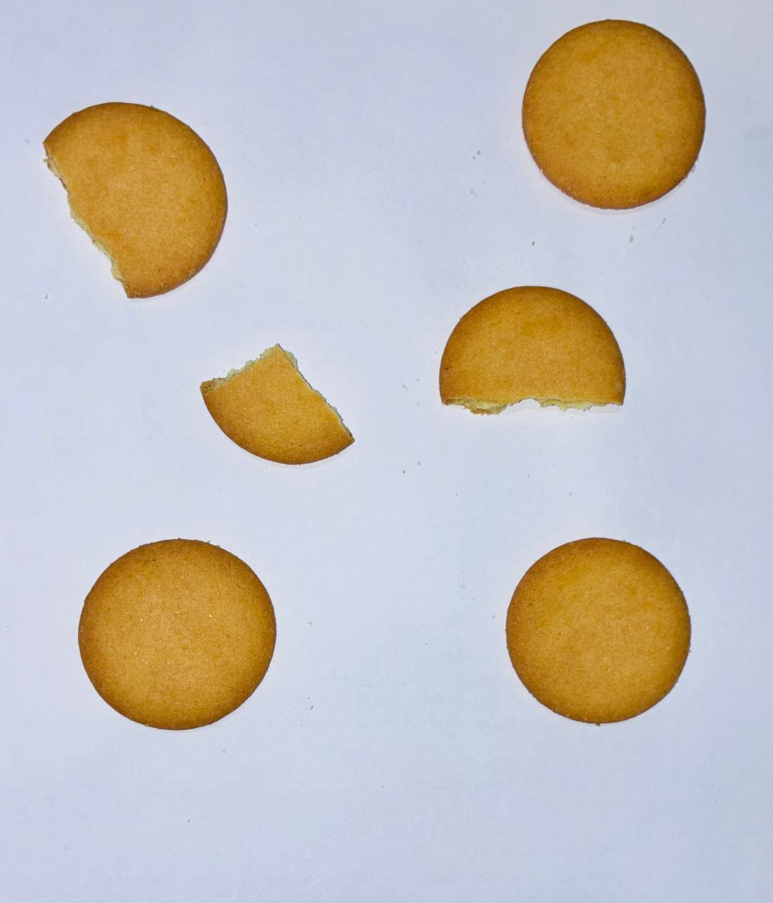
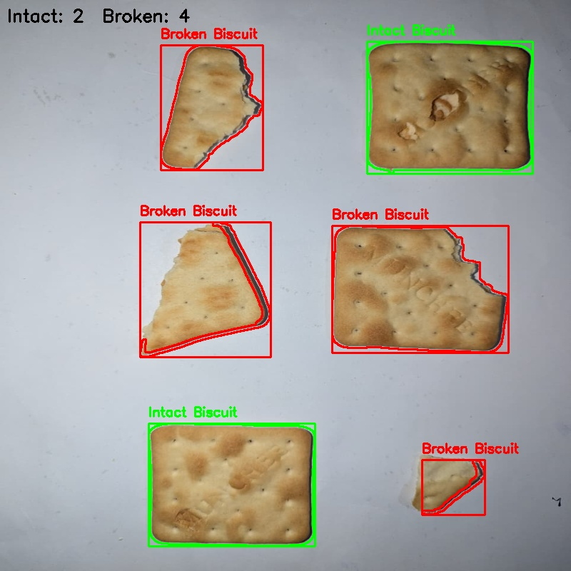
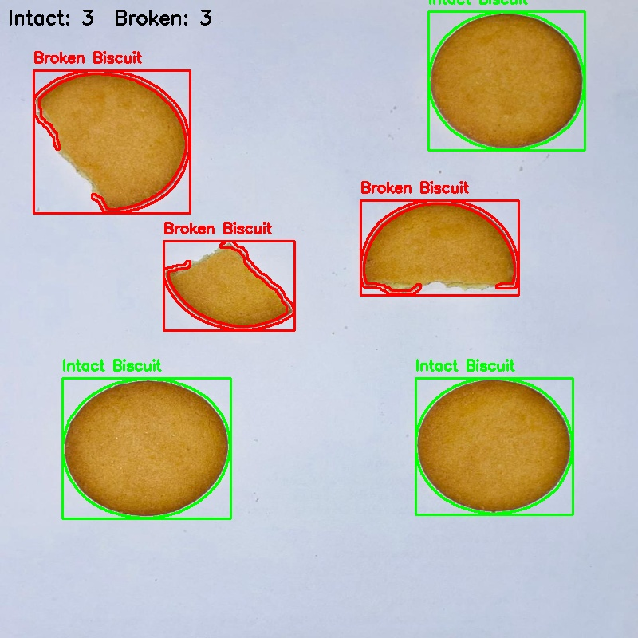

# 🍪 Broken Biscuit Detection using Classical Image Processing Techniques

## 📌 Problem Description

This project focuses on automatically identifying whether biscuits are **intact or broken** from images.  
Instead of manual inspection, image processing techniques are used to analyze the shape of each biscuit and make a decision.

All images are processed assuming a simple background, allowing accurate detection of biscuit boundaries.

⚠️ This project uses only classical image processing (no machine learning).

---

## 🛠️ Tools and Libraries

- Python 3.x
- OS Module
- OpenCV (`cv2`)  
- NumPy  

---

## 🧠 Processing Approach

The system follows an edge-based detection pipeline:

1. Convert image to grayscale  
2. Apply Gaussian blur to reduce noise  
3. Detect edges using Canny edge detector  
4. Improve edges using morphological operations  
5. Extract contours from the image  
6. Compute shape features:
   - Circularity (how round the biscuit is)  
   - Solidity (how complete the shape is)  
7. Classify each biscuit:
   - Intact → high circularity and solidity  
   - Broken → irregular shape  

---

## ▶️ Instructions to Run the Code

```bash
git clone https://github.com/thamiya2001/Broken-Biscuit-Detection.git
cd biscuit-detection
pip install opencv-python numpy
python code.ipynb
```

---

## 🖼️ Example Output Images

### Input




### Output



